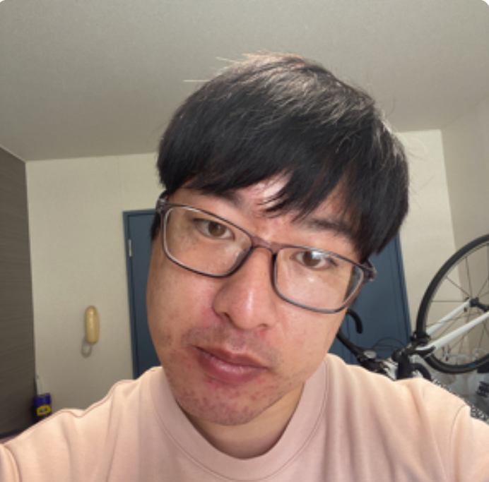
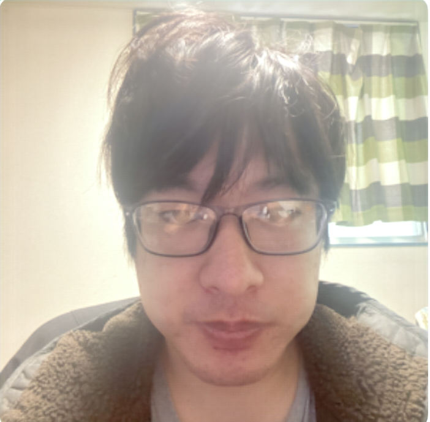

# Teraid Face API

顔画像の角度補正、明るさ調整、顔補正、解像度補正を行う FastAPI ベースのAPIです。  
画像は Base64 文字列として受け取り、処理後の画像も Base64 文字列で返却します。

## 主な機能

- 顔検出による入力画像のバリデーション
  - 顔が検出できない場合は `404`
  - 複数の顔が検出された場合は `409`
- Retinexformer による明るさ調整
- MediaPipe Face Landmarker による顔の角度補正と正面向きチェック
- GFPGAN による顔補正
- RealESRGAN による解像度補正
- SSM から設定値を取得
- S3互換ストレージからモデル重みを取得

## 技術スタック

- Python 3.10
- FastAPI / Uvicorn
- PyTorch / torchvision
- Pillow / NumPy / OpenCV
- SCRFD
- MediaPipe
- Retinexformer
- GFPGAN
- RealESRGAN
- boto3
- Docker Compose
- MinIO
- LocalStack
- pytest

## ディレクトリ構成

```text
app/
  apis/endpoints/                 APIエンドポイント
  controllers/                    リクエスト処理の制御
  services/                       顔画像処理のユースケース
  ml/                             MLモデル呼び出し
  core/aws/                       SSM / S3 クライアント
  helpers/                        バリデーション補助
  middlewares/                    リクエスト/レスポンスラッパー
docs/
  swagger.yaml                    OpenAPI定義
docker/local/
  Dockerfile                      ローカル開発用Dockerfile
tests/
  app/                            テストコード
  test_data/                      テスト用画像・SSM・S3データ
  tools/                          Base64変換ツール
```

## ローカル起動

### 前提

- Docker
- Docker Compose
- NVIDIA GPU を利用する場合は NVIDIA Container Toolkit

このプロジェクトの `docker-compose.yml` は `gpus: all` を指定しています。GPUを使わない環境では、必要に応じてこの指定を外してください。

### モデル重みの配置

APIは起動時または処理時に、SSMからモデル重みのキーを取得し、S3互換ストレージから重みファイルを読み込みます。

ローカルでは MinIO の `weights` バケットに以下のキーで重みを配置する想定です。

```text
weights/
  scrfd/scrfd.onnx
  facealignment/face_landmarker.task
  retinexformer/MST_Plus_Plus_8x1150.pth
  gfpgan/GFPGANv.pth
  gfpgan/detection_Resnet50_Final.pth
  gfpgan/parsing_parsenet.pth
  realesrgan/RealESRGAN_x2plus.pth
```

各AIモデルの取得方法と配置するファイル名は、以下の各ディレクトリの `Readme.md` を参照してください。

- SCRFD: [tests/test_data/s3/buckets/weights/scrfd/Readme.md](tests/test_data/s3/buckets/weights/scrfd/Readme.md)
- FaceAlignment: [tests/test_data/s3/buckets/weights/facealignment/Readme.md](tests/test_data/s3/buckets/weights/facealignment/Readme.md)
- Retinexformer: [tests/test_data/s3/buckets/weights/retinexformer/Readme.md](tests/test_data/s3/buckets/weights/retinexformer/Readme.md)
- GFPGAN: [tests/test_data/s3/buckets/weights/gfpgan/Readme.md](tests/test_data/s3/buckets/weights/gfpgan/Readme.md)
- RealESRGAN: [tests/test_data/s3/buckets/weights/realesrgan/Readme.md](tests/test_data/s3/buckets/weights/realesrgan/Readme.md)

SSMに登録される設定値は [tests/test_data/ssm/face_api_setting.json](tests/test_data/ssm/face_api_setting.json) を参照してください。

MinIOへテストデータ配下のファイルをアップロードする補助スクリプトがあります。

```bash
python tests/test_data/s3/build_s3.py
```

Docker Compose で起動する場合、SSM初期化は `teraid-face-api-ssm-init` サービスが実行します。

### 起動

```bash
docker compose up --build
```

起動後、APIは以下で利用できます。

```text
http://localhost:8005
```

FastAPI の自動ドキュメントは以下です。

```text
http://localhost:8005/docs
http://localhost:8005/redoc
```

MinIOコンソールは以下です。

```text
http://localhost:9003
```

デフォルトの認証情報:

```text
ユーザー名: dummy
パスワード: dummy123
```

## 環境変数

| 変数 | デフォルト | 用途 |
| --- | --- | --- |
| `PYTHONPATH` | `/app` | Pythonモジュール探索パス |
| `AWS_REGION` | `ap-northeast-1` | AWS/LocalStack/MinIO向けリージョン |
| `AWS_ACCESS_KEY_ID` | `dummy` | S3/SSM接続用アクセスキー |
| `AWS_SECRET_ACCESS_KEY` | `dummy123` | S3/SSM接続用シークレットキー |
| `SSM_ENDPOINT` | `http://localstack:4566` | SSMエンドポイント |

S3エンドポイントやモデル重みのキーは環境変数ではなく、SSMパラメータから取得します。

## API仕様

### 顔画像処理

```http
POST /face-image-process/
Content-Type: application/json
```

リクエスト:

```json
{
  "content": "Base64 encoded image",
  "extension": "png",
  "use_angle_correction": true,
  "use_brightness_adjustment_lm": true,
  "use_correction_lm": true,
  "use_resolution_lm": false
}
```

| 項目 | 型 | 必須 | 説明 |
| --- | --- | --- | --- |
| `content` | string | yes | 入力画像のBase64文字列 |
| `extension` | string | yes | 出力画像形式。`jpeg` または `png` |
| `use_angle_correction` | boolean | yes | MediaPipe Face Landmarkerによる顔の角度補正を行うか。横向き・上下向きが大きい場合は正面向きチェックでエラー |
| `use_brightness_adjustment_lm` | boolean | yes | Retinexformerによる明るさ調整を行うか |
| `use_correction_lm` | boolean | yes | GFPGANによる顔補正を行うか |
| `use_resolution_lm` | boolean | yes | RealESRGANによる解像度補正を行うか |

正常レスポンス:

```json
{
  "status": "success",
  "data": {
    "content": "Base64 encoded processed image",
    "extension": "png",
    "size_bytes": 123456
  }
}
```

エラーレスポンス:

| ステータス | 条件 |
| --- | --- |
| `404` | 顔が検出できない、または角度補正・正面向きチェックに失敗した |
| `409` | 複数の顔が検出された |
| `422` | リクエストバリデーションエラー |

詳細なOpenAPI定義は [docs/swagger.yaml](docs/swagger.yaml) を参照してください。

## リクエスト例

```bash
curl -X POST http://localhost:8005/face-image-process/ \
  -H "Content-Type: application/json" \
  -d '{
    "content": "Base64 encoded image",
    "extension": "png",
    "use_angle_correction": true,
    "use_brightness_adjustment_lm": true,
    "use_correction_lm": true,
    "use_resolution_lm": false
  }'
```

## 画像Base64変換ツール

`tests/tools/images` 配下の画像をBase64へ変換できます。

```bash
python tests/tools/image_to_base64.py one_face.png
```

出力先:

```text
tests/tools/output.txt
```

Base64文字列を画像へ戻す場合は、プロジェクトルートに `sample.txt` を置いて以下を実行します。

```bash
python decode_sample_image.py
```

## テスト

依存関係をインストールします。

```bash
pip install -r requirements.txt -r requirements_dev.txt
```

テストを実行します。

```bash
pytest
```

S3/SSMを使うテストでは、LocalStackやMinIOなどのローカルサービスが必要になる場合があります。Docker Composeで周辺サービスを起動してから実行してください。

## 補足

- API本体のエントリポイントは [app/main.py](app/main.py) です。
- 顔画像処理の中心ロジックは [app/services/face_image_processing_service.py](app/services/face_image_processing_service.py) です。
- CORSは `http://localhost:3000` と `http://localhost:3001` を許可しています。

## サンプル
## 顔正面補正
| 元画像 | 顔正面補正 |
| --- | --- |
|  |  |

### 明るさ補正

| 元画像 | 明るさ補正 |
| --- | --- |
|  |  |

### 明るさ+顔補正

| 元画像 | 明るさ+顔補正 |
| --- | --- |
|  |  |

### 明るさ+顔+解像度補正

| 元画像 | 明るさ+顔+解像度補正 |
| --- | --- |
|  |  |
